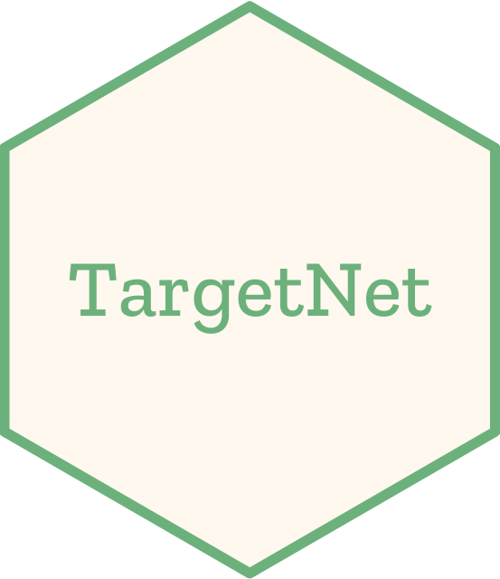

# TargetNet 

Powered by large-scale machine learning modeling of public chemogenomics data, TargetNet ([Mirror 1](https://nanx.app/targetnet/), [Mirror 2](https://nanx.shinyapps.io/targetnet/)) is a shiny app for predicting the binding probability of 623 potential drug targets for given small molecule(s).

This repository (`master` branch) contains the source code of the app. The `gh-pages` branch serves the information pages for the [632 drug targets](https://nanx.me/targetnet/), which can be accessed from the app itself.

## Contact

If you have any questions, please feel free to contact: [me@nanx.me](mailto:me@nanx.me).
