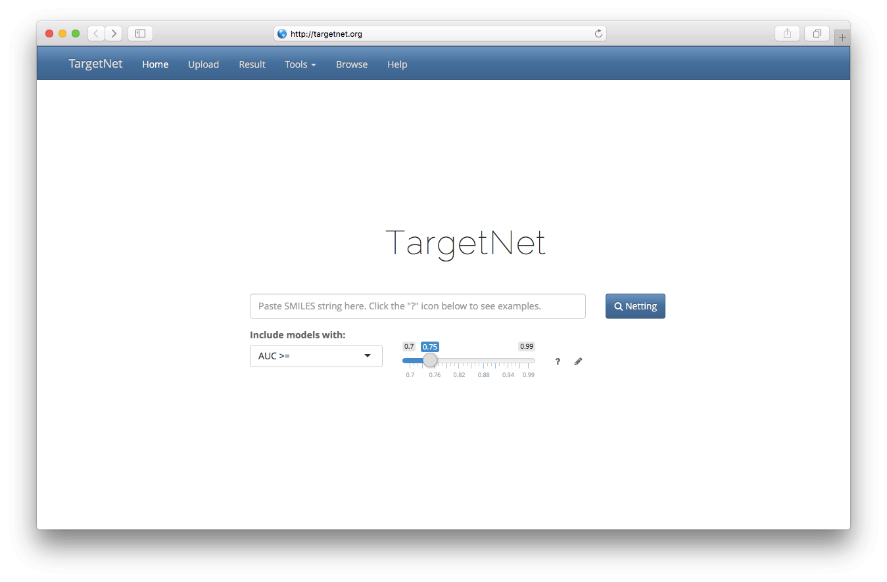
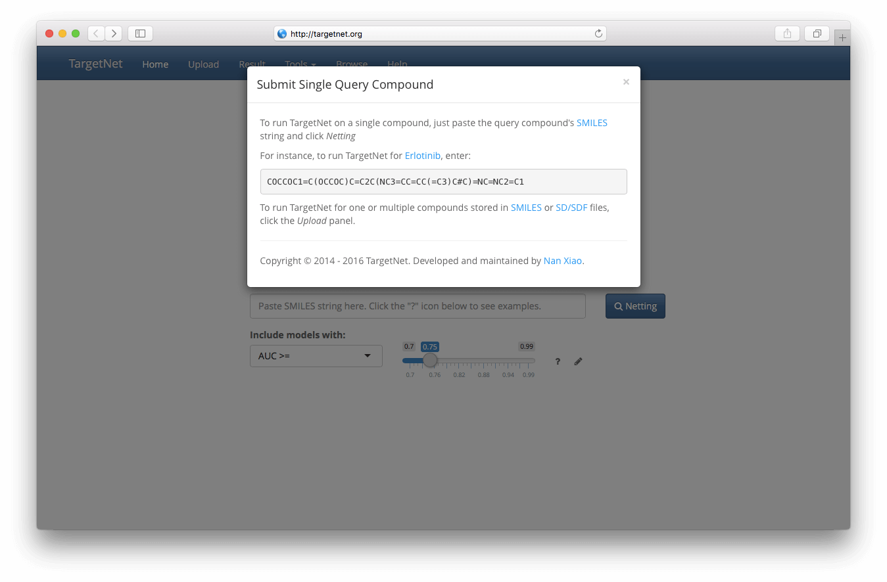
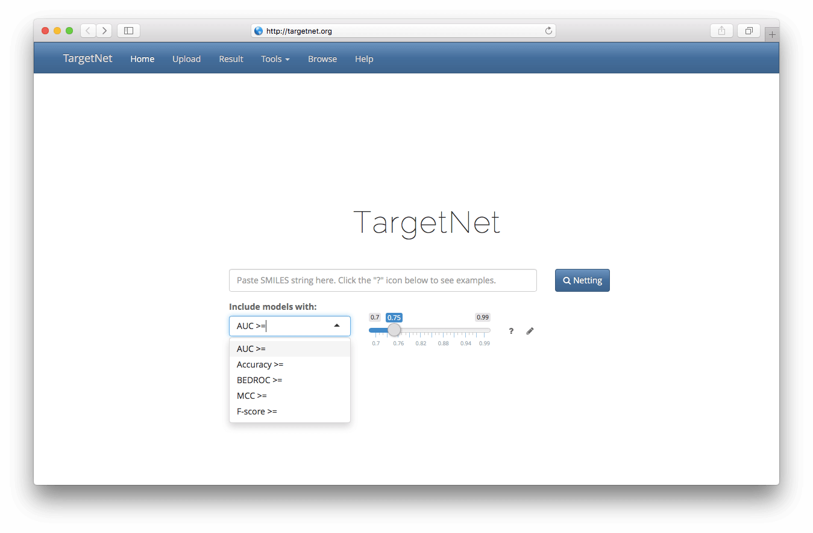
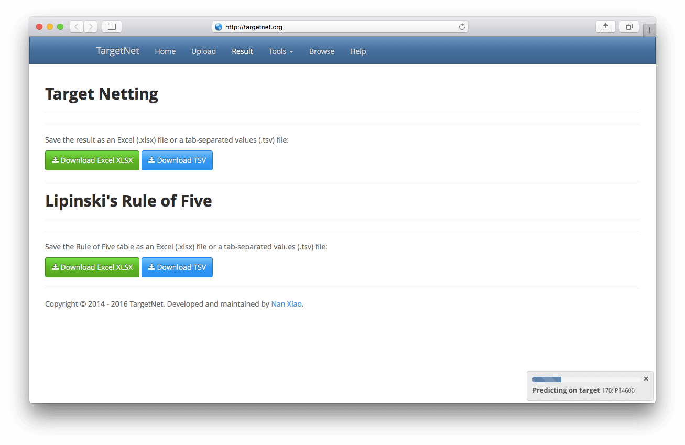
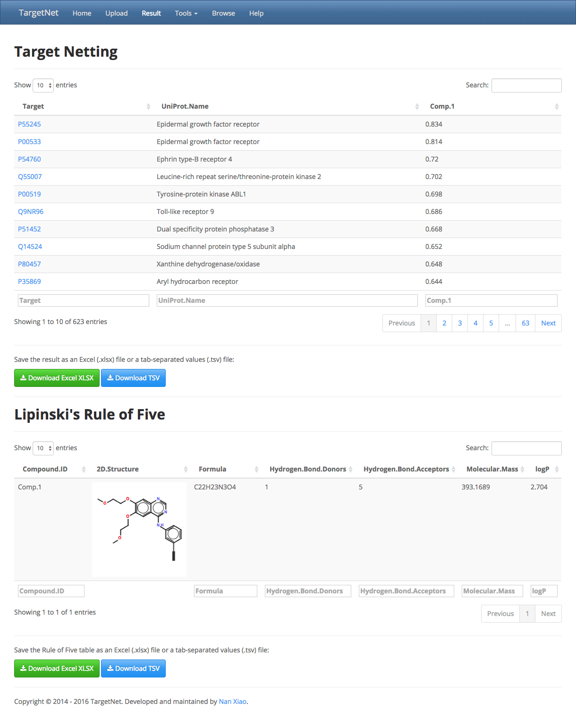
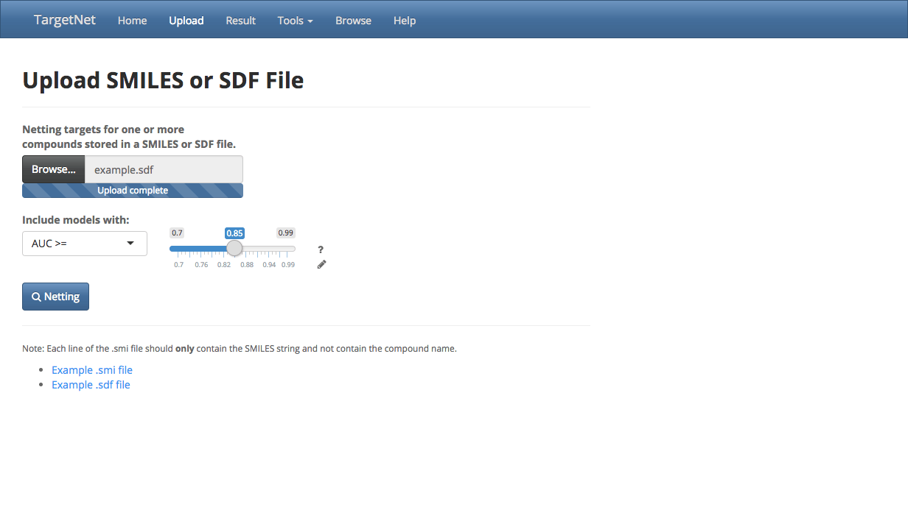
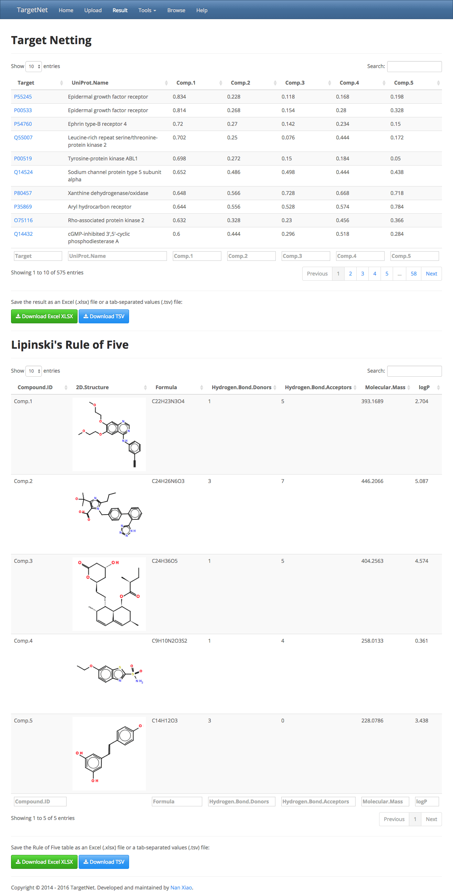
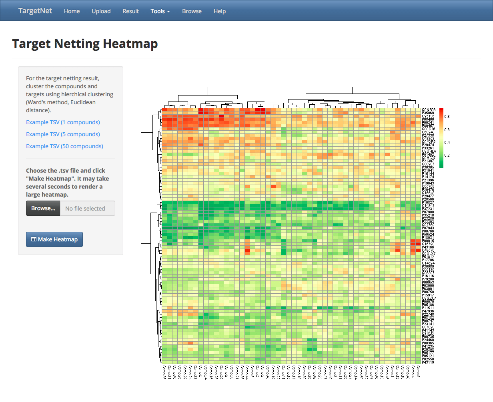
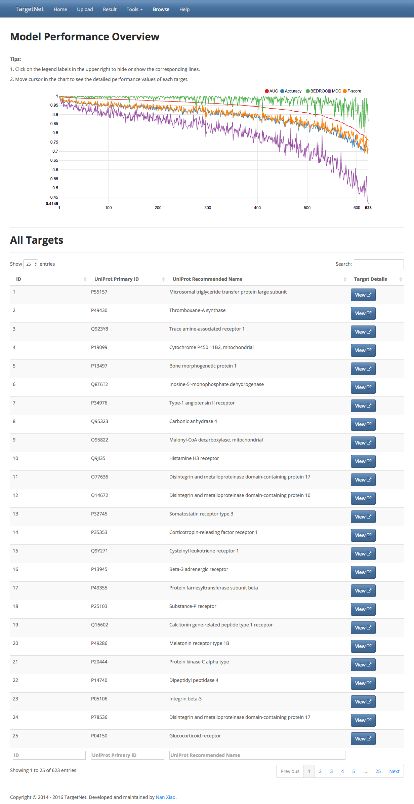
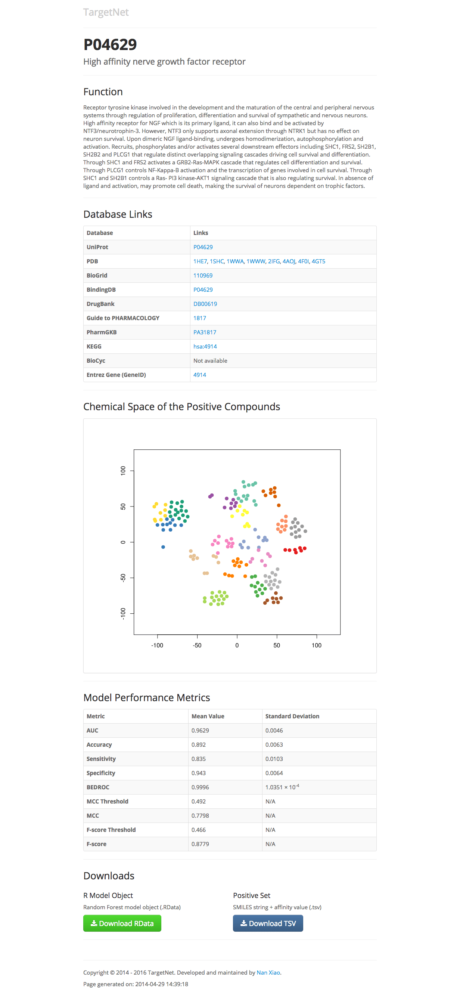

<h3 class="muted">TargetNet</h3>

# 
<strong>TargetNet User Guide</strong>

In this guide, we will demonstrate how to use TargetNet to find potential drug targets for your compound.

## 1. Submit single query molecule

Go to the app ([mirror 1](https://nanx.app/targetnet/), [mirror 2](https://nanx.shinyapps.io/targetnet/)). You will see the TargetNet landing page:

### 1.1 Submit single molecule represented by SMILES strings

For one molecule, you will need the [SMILES](http://www.daylight.com/smiles/) string representing the molecule. Click the `?` icon to get an example.

Paste the SMILES string of your compound into the search box.

Each target in TargetNet corresponds to a QSAR model. You can choose models with cross validation performance metrics higher than a threshold value. Available metrics includes: AUC (Area Under ROC Curve), Accuracy, BEDROC (Boltzmann-Enhanced Discrimination of Receiver Operating Characteristic), MCC (Matthews Correlation Coefficient), F-Score.

After choosing the metric, move the slider on the right to select the threshold value. By default (AUC >= 0.75), the computation will cover all targets.

After these, click the `Netting!` button.

### 1.2. View results

After clicking the `Netting!` button, it will automatically jump to the `Result` tab, a progress bar will show in the upper right of the page, showing the computation progress.

When the computation is done (usually in less than one minute), the result will appear as two tables.

The first table shows each target's name, UniProt name, and the predicted probability of binding. Click `'Comp.1'` to show the result in ascending order or descending order. Searching ID or name of the targets is also available. Most importantly, you can download the table as an Excel XLSX file or a TSV (Tab-Separated Values) file.

The second table shows the [Lipinski's Rule of Five](https://en.wikipedia.org/wiki/Lipinski's_rule_of_five) computation result and 2D structure of the molecule. You can also download the table as an Excel XLSX file or a TSV file.

## 2. Submit multiple query molecules

You can submit several molecules at once in TargetNet. For multiple molecules, we will need a SDF file or a SMI file storing the molecules.

### 2.1. Submit multiple molecules stored in SMI and SDF files

Open TargetNet, and click the `Upload` tab.

Note:
<em>You will need to refresh the page if you have pasted a SMILES string in the search box on the frontpage.</em>

On this page, click `Choose File` and select your `.sdf` or `.smi` file storing the compounds, the file will be automatically uploaded. Choose the performance metric and threshold value, then click `Netting!`.

The example `.sdf` and `.smi` files are provided on the page.

### 2.2. View results

When the computation is done, the result will appear as two tables.

The first table contains each target's name, UniProt name, and their predicted probability of binding. Each column named `Comp.X` contains the predicted binding probability for that compound. Click the compound ID in the table header to reorder the result by that column. You can also download the table as an Excel XLSX file or a TSV file. The TSV file could be uploaded in the next part to make heatmaps.

## 3. Make heatmap using the results

Click the tab `Visualize`, then click `Choose File`, select the TSV file downloaded in the previous step, and the file will be automatically uploaded. Click `Make Heatmap`, a heatmap with hierachical clustering result will appear on the right.

Three example result TSV files are provided in the left panel on this page.

## 4. Browse all targets in TargetNet

Click the `Browse` tab. The page contains an introduction text of TargetNet, a performance chart showing the performance metrics of all the models used in TargetNet, and a table with links to detail pages of the targets.

The introduction briefly describes the motivation and methods of TargetNet.

For the chart, click the legend labels in the upper right to hide or show the corresponding metric lines. Move cursor in the chart to see the detailed performance values of each target.

For the target information table, click the `View` button in the last column to open the page containing detailed information about the target. The page includes the target's biological function; its links to different reference databases, including UniProt, PDB, BioGrid, BindingDB, DrugBank, Guide to PHARMACOLOGY, PharmGKB, KEGG, BioCyc, and Entrez Gene; a visulization of chemical space of the positive compounds for the target; model performance metrics; download of the R model object; download of the positive set used for modeling.

A typical target detail page looks like:

<footer>

Copyright &copy; 2014 - 2016 TargetNet. Developed and maintained by <a href="https://nanx.me">Nan Xiao</a>.

Last revision: 2016-04-25 10:10:00 CST.

</footer>

